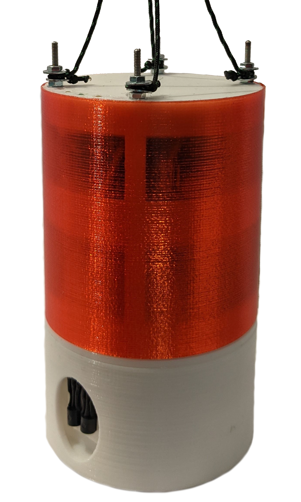
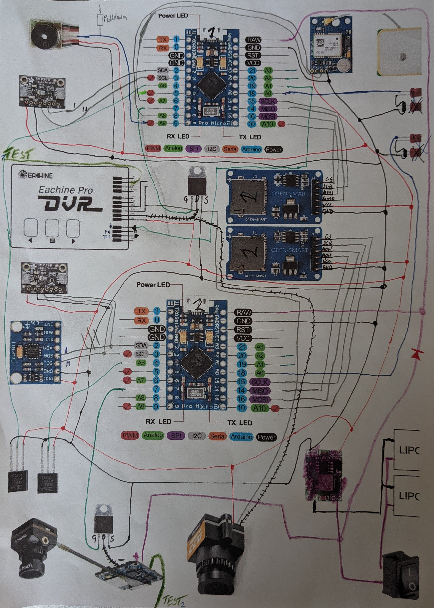

# CanSat2021

CanSat-Projekt des Teams AdAstra

## To-Do-Liste
### Software
- Fehleranfälligkeit Pause für immer bei z.B. SD-Fehler oder BMP Fehler entfernen
- passende LED & Piper Rückmeldung
- eventuell GPS-Daten besser verarbeiten:
  - Modul sendet ca. jede Sekunde alle NMEA-Nachrichten (mit kurzen Pausen zwischen den Sätzen, daher springt das Programm durchaus weiter)
  - aktuelle Software horcht einmal pro Zyklus ob GPS-Modul sendet, wenn ja speichert es alles was liest (Software-Serial) auf die SD-Karte.
  - wenn nicht im passenden Moment gehorcht wird gehen Daten verloren
- keine großen Änderungen mehr möglich, da der Programmspeicher des ATmega32U4 zu 96% ausgereizt ist. (Arduino Pro Micro) beim nächsten Projekt wird kein interner speicherfressender Bootloader verwendet...
    

### Hardware
- Optimierung und finaler Test des Bergungssystems
- Schutzhülle und Schutzkappe neue Version drucken

## Schaltplan

## [Betriebsanleitung](Ad_Astra_Betriebsanleitung_2021-04-18.pdf)

## Zeitplan
|Aktivität|Datum|
|--|--|
|Abgabe der ersten Version der Betriebsanleitung| Sonntag, 18. April 2021 |
| **Abgabe der finalen Version der Betriebsanleitung** | **Montag, 10. Mai 2021** |
| **Spätester Versand des CanSats** | **Montag, 10. Mai 2021** |
| Individuelles Auspacken der CanSats und technische Abnahme | KW 20 |
| **Durchführung der Starts** | **Dienstag, 25. Mai 2021** |
| Back-Up: Durchführung der Starts | Donnerstag, 27. Mai 2021 |
| Back-Up: Durchführung der Starts | Montag, 31. Mai 2021 |
| Rücksendung der CanSats | KW 22 |
| **Abgabe der Auswertungsposter** | **Dienstag, 15. Juni 2021** |
| Virtuelle Abschlusspräsentation, -veranstaltung | Donnerstag, 17. Juni 2021 |
